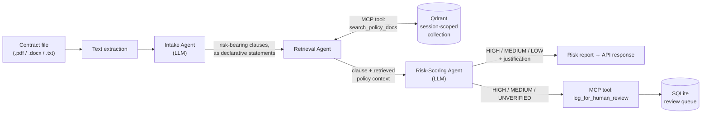

# ClauseGuard — Backend

**A multi-agent, RAG-powered contract compliance auditor.** Upload your company's policy documents, upload a contract, and ClauseGuard extracts every risk-bearing clause, checks it against your policies with retrieval-augmented generation, and returns a risk-scored report — with every flagged clause automatically routed to a human-in-the-loop review queue through MCP tools.

🔗 **Live app:** https://clause-guard-live.vercel.app
🎨 **Frontend repo:** [ClauseGuard_frontend](https://github.com/Danialpro2k04/ClauseGuard_frontend)
👤 **Built by:** [Danyal Wahdat](https://www.linkedin.com/in/danyal-wahdat-b747a928b/)


---

## Why I built this

Legal and compliance teams manually cross-reference contracts against internal policy every time a new vendor agreement or NDA lands on their desk. It's slow, repetitive, and easy to miss the one sentence in paragraph 4 that contradicts the security policy in a document nobody re-reads. ClauseGuard automates the first pass: it doesn't replace a lawyer, it hands one a pre-flagged, evidence-cited shortlist instead of a blank contract.

This was also my hands-on project for learning **multi-agent orchestration** and the **Model Context Protocol (MCP)** — retrieval and human-review-logging are exposed as MCP tools rather than hardcoded function calls, so they could be swapped for a hosted MCP server or reused by a different agent without touching the pipeline logic.

## How it works

Three specialized agents run in sequence, each handing a structured payload to the next:



1. **Intake Agent** (`agents/intake.py`) — prompts the LLM to read the raw contract and extract every risk-bearing clause (data security, liability, retention, IP, etc.) as a **declarative compliance statement** rather than a question, so it can later be semantically matched against policy text. A granularity rule forces the model to split compound clauses (e.g. "audits happen quarterly, and on-site inspection is prohibited") into separate entries instead of merging distinct obligations.
2. **Retrieval Agent** (`agents/retrieval.py`) — for each clause, queries the vector store **twice**: once with the raw clause text, once with the generated compliance statement. The two result sets are merged and deduplicated on exact passage blocks, so the risk scorer sees the widest relevant context without duplicate noise.
3. **Risk-Scoring Agent** (`agents/risk_scorer.py`) — grades each clause `HIGH` / `MEDIUM` / `LOW` against the retrieved policy passages only. It's explicitly instructed to cite which `[Policy Result N]` it drew from and is forbidden from inventing "industry standard" figures that don't appear in the retrieved text. Anything `HIGH`, `MEDIUM`, or where retrieval itself failed (`UNVERIFIED`) is logged to the human review queue automatically.

All LLM calls are routed through a single `call_llm()` wrapper (`agents/llm.py`) built on **LiteLLM**, so the provider (Groq / OpenAI / Anthropic) and model are just strings passed in per-request — no per-provider branching in the agents themselves.

## Engineering details worth calling out

- **Ungrounded ≠ scored.** If policy retrieval fails or returns nothing relevant, the pipeline never asks the LLM to "guess" a risk score from an empty context — it routes straight to `UNVERIFIED` for manual review. This was a deliberate call to avoid a confident-looking but ungrounded hallucination.
- **Dual-query retrieval + merge-dedup.** Matching on the compliance statement alone can miss clauses with distinctive phrasing; matching on raw clause text alone can miss what the clause actually *means*. Querying both and merging catches more.
- **Retry logic tuned for a free-tier LLM.** `call_llm()` retries on rate limits (Groq's TPM caps) and on malformed JSON output (LLMs occasionally wrap JSON in prose or code fences) — the response is stripped of markdown fences and brace-matched before parsing, with up to 5 attempts before failing loudly.
- **Rate-limit pacing.** A `0.7s` sleep between clause-scoring calls in `run_risk_scoring_agent` keeps multi-clause contracts under Groq's free-tier tokens-per-minute limit instead of throwing mid-audit.
- **Multi-tenant isolation on a single-node DB.** Qdrant runs embedded (`QdrantClient(path=...)`, no external server) and each session gets its own collection named after `session_id`. No user's policy documents are ever queried by another session, and the collection is dropped when the session ends — all without standing up a managed vector database.
- **MCP as the tool boundary.** `search_policy_docs` and `log_for_human_review` are registered as MCP tools (`server/mcp_server.py`) via FastMCP, while remaining plain, directly-callable Python functions for the agents. This keeps the retrieval/logging surface swappable without an MCP client in the loop for the current deployment.
- **Zero server-side secrets.** LLM and Cohere embedding API keys are supplied per-request (`Authorization: Bearer`) and used only for that call — nothing is written to disk or environment variables.

## Tech stack

| Layer | Choice |
|---|---|
| API framework | FastAPI + Uvicorn |
| LLM routing | LiteLLM (Groq / OpenAI / Anthropic, one interface) |
| Agent-tool protocol | MCP via FastMCP |
| Vector search | Qdrant (embedded, on-disk, session-scoped collections) |
| Embeddings | Cohere `embed-english-v3.0` |
| Chunking | LangChain `RecursiveCharacterTextSplitter` |
| File parsing | `pypdf`, `python-docx` |
| Human-review persistence | SQLite (WAL mode) |
| Deployment | FastAPI Cloud |

## Project structure

```
.
├── main.py                # FastAPI app + all HTTP routes
├── pipeline.py             # Orchestrates intake → retrieval → risk-scoring
├── review_store.py         # SQLite-backed human-in-the-loop review queue
├── ingest_corpus.py         # Standalone CLI to bulk-ingest a static policy corpus
├── agents/
│   ├── intake.py            # Clause-extraction agent
│   ├── retrieval.py          # Dual-query retrieval + merge/dedup agent
│   ├── risk_scorer.py         # Grounded risk-scoring agent
│   └── llm.py               # Provider-agnostic LLM call wrapper (LiteLLM + retries)
└── server/
    └── mcp_server.py          # FastMCP server: Qdrant search + review-logging tools
```

## API reference

| Method | Endpoint | Description |
|---|---|---|
| `POST` | `/api/v1/policies` | Form: `session_id`, `files[]`. Header: `Authorization: Bearer <cohere_key>`. Chunks and embeds the uploaded policy documents into a session-scoped Qdrant collection. |
| `POST` | `/api/v1/audit` | Form: `session_id`, `provider`, `model_name`, `embedding_api_key`, `file`. Header: `Authorization: Bearer <llm_api_key>`. Runs the full 3-agent pipeline and returns the risk report. |
| `DELETE` | `/api/v1/session/{session_id}` | Drops the session's Qdrant collection. |
| `GET` | `/api/v1/reviews?status=` | Lists pending (or filtered) human-in-the-loop reviews. |
| `DELETE` | `/api/v1/reviews/{review_id}` | Marks a review as resolved. |

API keys are **never persisted** — they live in request scope only, for the duration of that call.

## Running locally

```bash
git clone https://github.com/Danialpro2k04/ClauseGuard_backend.git
cd ClauseGuard_backend
python -m venv venv && source venv/bin/activate   # Windows: venv\Scripts\activate
pip install -r requirements.txt
uvicorn main:app --reload
```

No `.env` file or hardcoded secrets are required to run the API — LLM and embedding keys are supplied by the client per-request. Qdrant's on-disk store (`qdrant_db/`) and the SQLite review DB (`pending_reviews.db`) are created automatically on first run.

To bulk-ingest a static policy corpus outside the per-session web flow (useful for local testing), drop text files into a `corpus/` folder and run:

```bash
python ingest_corpus.py
```

## Known limitations — built entirely on free tiers

This was intentionally built to run end-to-end without a paid dependency, which comes with real tradeoffs I'd change for a production deployment:

- **Embedded Qdrant** is single-node and file-based — it won't horizontally scale or survive a redeploy that wipes the filesystem. A hosted Qdrant/Pinecone instance would fix this.
- **Groq's free-tier TPM limit** forces sequential, paced LLM calls — a large contract with many clauses takes longer than it needs to. A paid tier or batched scoring would remove the artificial pacing.
- **Cohere's free embedding tier** caps at 1,000 calls/month, which is fine for demo-scale use but not for a real team's document volume.
- **SQLite** for the review queue is fine for a single-instance demo, not for concurrent multi-tenant write load.
- **No OCR** — `pypdf` extracts embedded text only, so scanned/image-only PDFs won't parse.
- **No auth/accounts** — sessions are ephemeral and identified only by a client-generated `session_id`.

## Roadmap

- [ ] Swap embedded Qdrant for a hosted instance + add a `LICENSE` file (MIT)
- [ ] Batch clause-scoring into fewer LLM calls to reduce audit latency
- [ ] Structured-output mode (JSON schema / function calling) instead of prompt-enforced JSON, where the provider supports it
- [ ] Optional OCR fallback for scanned PDFs
- [ ] Lightweight session auth so review queues aren't purely client-trusted

---

Questions, feedback, or found a bug? Open an issue or reach out on [LinkedIn](https://www.linkedin.com/in/danyal-wahdat-b747a928b/).